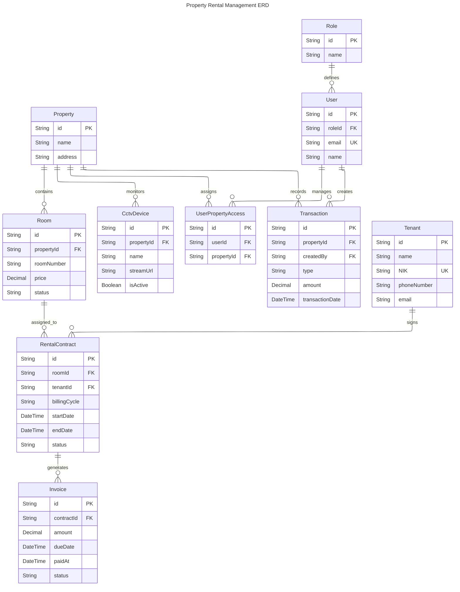

```mermaid
---
title: Property Rental Management ERD
config:
  layout: elk
---
erDiagram
    direction TB

    Property ||--o{ Room : contains
    Property ||--o{ CctvDevice : monitors
    Property ||--o{ UserPropertyAccess : assigns
    Property ||--o{ Transaction : records

    User ||--o{ UserPropertyAccess : manages
    User ||--o{ Transaction : creates
    Role ||--o{ User : defines

    Room ||--o{ RentalContract : assigned_to
    Tenant ||--o{ RentalContract : signs
    RentalContract ||--o{ Invoice : generates

    Property {
        String id PK
        String name
        String address
    }

    CctvDevice {
        String id PK
        String propertyId FK
        String name
        String streamUrl
        Boolean isActive
    }

    UserPropertyAccess {
        String id PK
        String userId FK
        String propertyId FK
    }

    Role {
        String id PK
        String name
    }

    User {
        String id PK
        String roleId FK
        String email UK
        String name
    }

    Room {
        String id PK
        String propertyId FK
        String roomNumber
        Decimal price
        String status
    }

    Tenant {
        String id PK
        String name
        String NIK UK
        String phoneNumber
        String email
    }

    RentalContract {
        String id PK
        String roomId FK
        String tenantId FK
        String billingCycle
        DateTime startDate
        DateTime endDate
        String status
    }

    Invoice {
        String id PK
        String contractId FK
        Decimal amount
        DateTime dueDate
        DateTime paidAt
        String status
    }

    Transaction {
        String id PK
        String propertyId FK
        String createdBy FK
        String type
        Decimal amount
        DateTime transactionDate
    }
```